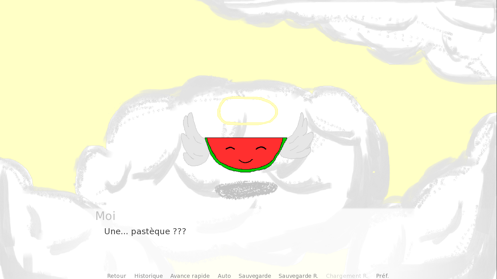
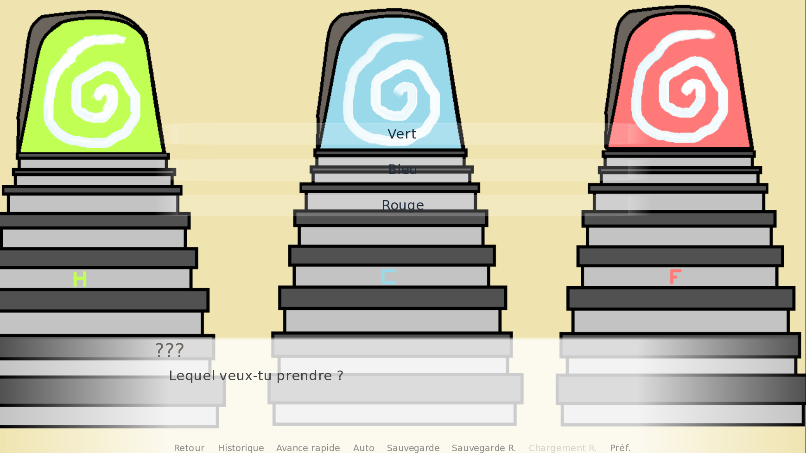
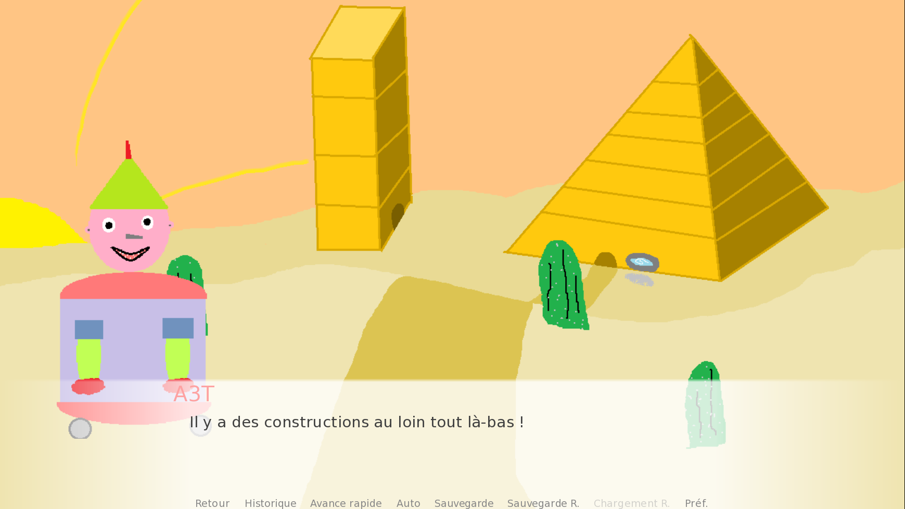
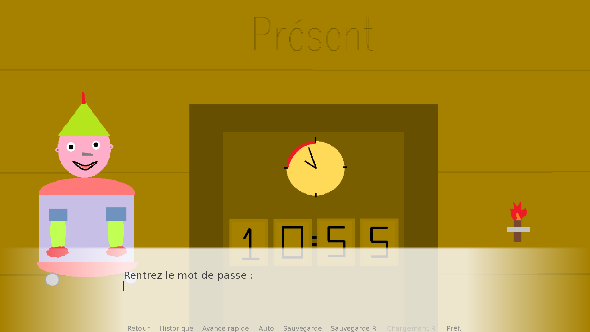
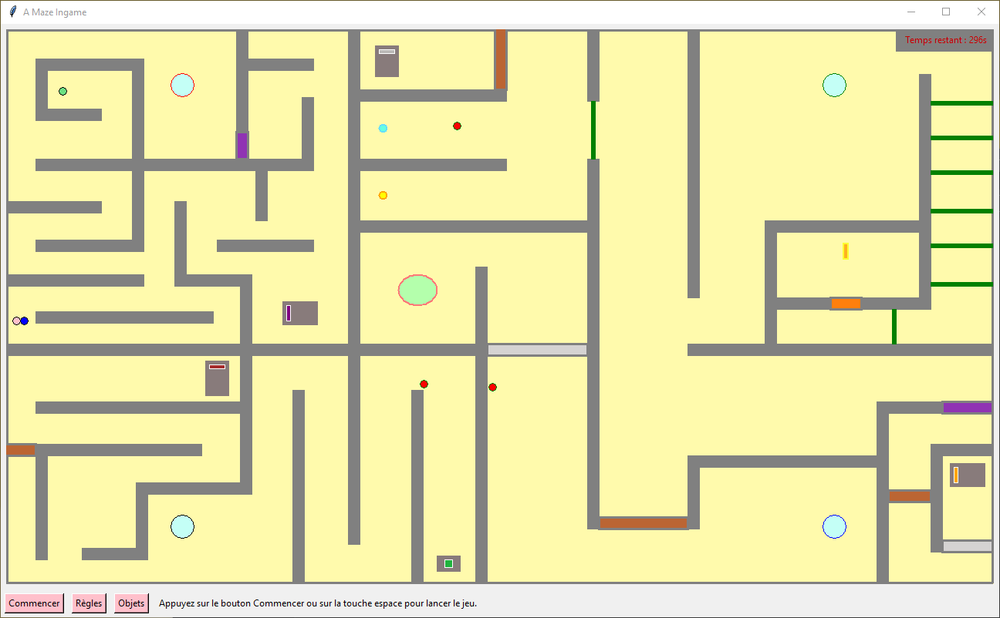
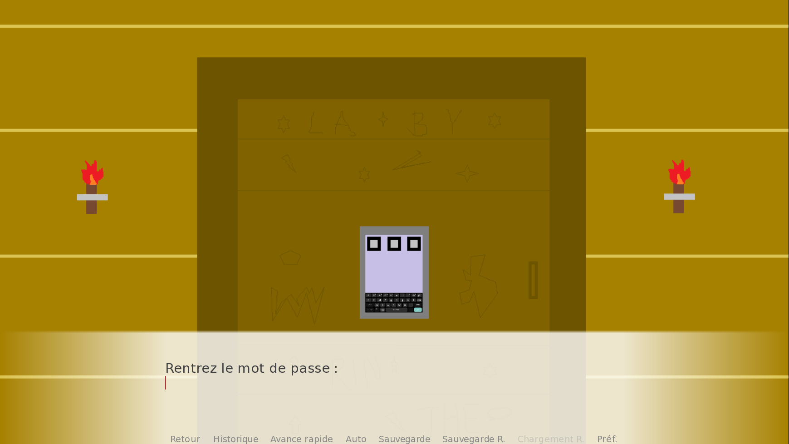
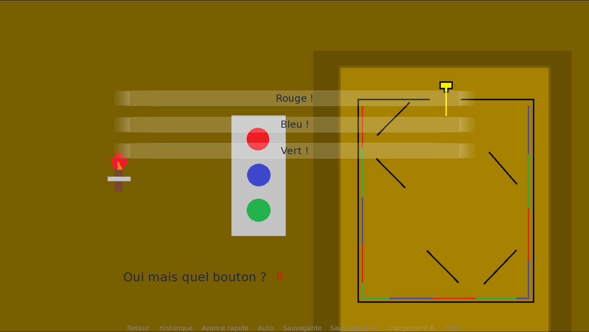
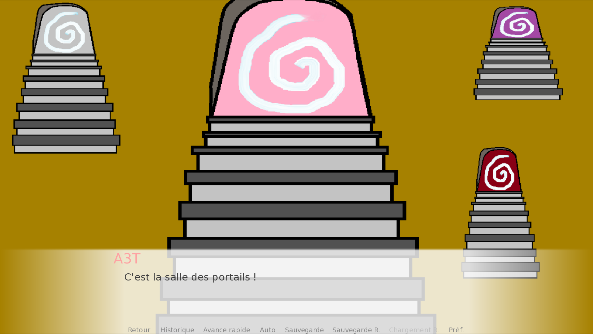

# La Voie de la Pastèque

**La Voie de la Pastèque** is a high school project made by myself and two classmates. This game is a visual novel made with Ren'py and Python. 
  
[**You can download the compressed folder of the game here.**](https://github.com/chengzhe-wang/La-Voie-de-la-Pasteque/raw/main/Game/LaVoieDeLaPasteque.zip)  
Once extracted, you have to launch *LaVoiedelaPasteque.exe* then you can enjoy the game.
  
During the game, there will be three portals : this is where we separated our work. Every portal leads to a part of the game that each of us created independently. For example, the portal with the letter "C" is the part that I made as the "C" stands for Chengzhe.  

## Start of the game
As the game starts, you wake up facing a talking watermelon, the *God of Watermelons*. Soon after, your memories slowly come back and you realise that you were escaping a murderer.  

  
  
While running away, you eventually get into a portal room with three different portals. In order to make it out alive, you have to quickly chose one. Chose the blue portal to see my work.

  

## Blue portal

  

After entering the blue portal, you get teleported in another world. A world filled with desert. This place looks empty, you see nothing except sand, cactuses and... a strange creature. Its name is *A3T* and you quickly become friends since you are both escaping the murderer.  
As you keep running away, you run into two buildings : a **pyramid** and a **tower**. You will have to solve different puzzles in order to go further away.

  

### Tower of Time

The left way leads you to the *Tower of Time*. Once you get in, you see a clock with the time written below that looks like a password. The numbers can be changed and you will have to put in the right answer to open the door.

  

The tower gives you access to a key that is required later on. 

  
<strong>Click here to reveal the password</strong>

  
  The password is the time of your computer. For example, at 10:35, you have to write ***1035***. It might not work sometimes, it is due to the fact that the hour changed and a minute passed. You can try again and it will eventually work.

### Pyramid

The right way leads you to a pyramid with a mind portal. The mind portal only teleports your spirit into another world. In this case, a mini-game is opened in another window. (I couldn't incorporate the minigame directly in the visual novel so I had to find a way that goes along well with the scenario). To go further in the pyramid, you will need to solve the minigame.  

#### Maze

In this minigame, you and your friend gets teleported into a maze. Your characters are represented by two littles dots, a blue and a pink one. You need to navigate through the maze with the purpose of reaching the middle portal. To access the middle portal, the orange key is necessary. You can activate the levers to open and close the gates and take the portals to teleport yourselves. Of course, as you travelled a whole desert to get here, you are physically and mentally tired. Your characters get slower and slower over time and you will need to eat the apples on the ground to recover some stamina and speed. The time is ticking, you only have five minutes to make it across the maze.  

  

This minigame is quite hard and it might take you multiple times to achieve it. It gives a code for the pyramid.

  
<strong>You can click here to see the code</strong>

  
  *A3T* is written on a stele.

This little game was entirely made with Python. It uses the *Snake* movement system and all the interactions are based on their color. When a color overlaps the player, it determines which action should be done. For example, the **red** color gives you speed since it is the color of the apples.

#### Laser Room

  

In the pyramid, with the code you get from the maze and the key from the tower combined, you get access to the next room that contains multiple doors with laser puzzles on it. You have to be fast and find where the laser points after it gets reflected by the black mirrors. There are three colors, the laser will point one of them and you have to chose the correct color.

  

  
<strong>There will be three doors, the answers are : </strong>

  
  *Blue - Red - Blue*

### Final portal room

  

You finally find a way to escape and this is where your memories end, aswell as the game. 
